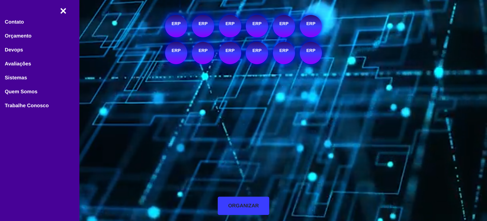
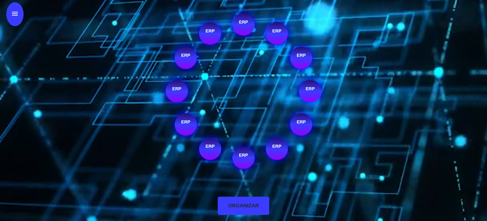
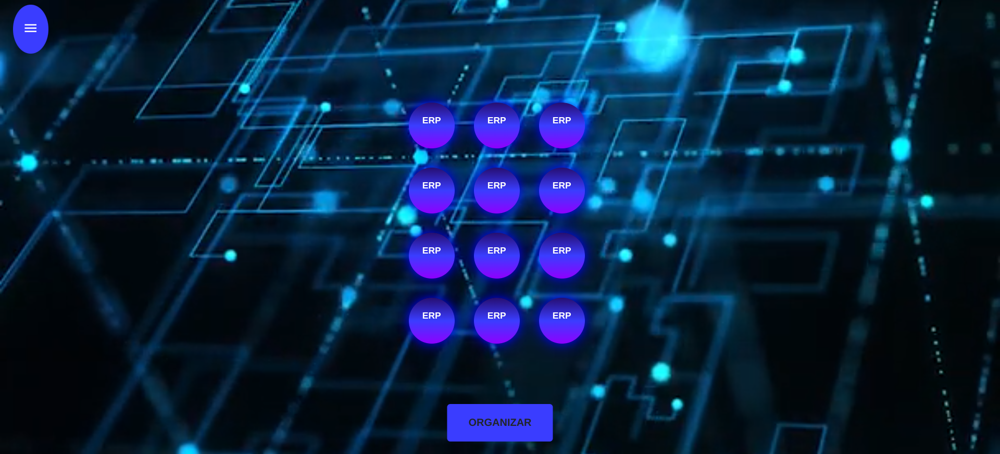

# Dancing Buttons - Projeto Simples de Movimento

Este é um projeto web simples que demonstra o movimento de elementos HTML (`div` e `button`) usando JavaScript e manipulação de propriedades CSS `left` e `top`.

## Funcionalidades

*   **Objeto Móvel:** Um quadrado vermelho (`#meuObjeto`) que pode ser movido para a direita e para baixo.
*   **Botão Móvel:** Um botão de menu (`#menuBotao`) que pode ser movido para a direita.
*   **Tecnologias:** HTML, CSS e JavaScript puro.

## Como Usar

1.  Clone este repositório.
2.  Abra o arquivo `index.html` em qualquer navegador web.
3.  Clique nos botões "Mover Objeto para a direita", "Mover Objeto para baixo" e "Mover Menu para a direita" para ver os elementos se moverem.

## Assets de Referência (Projeto Avançado)

Os seguintes arquivos foram fornecidos como referência para um projeto de "Botões Dançantes" mais avançado, que **não está implementado neste código simples**, mas que servem como inspiração para futuras implementações.

### 1. Menu Lateral e Organização em Linha

Esta imagem demonstra uma possível interface de usuário com um menu lateral e a organização dos botões "ERP" em linhas.

### 2. Organização Circular

Esta imagem mostra uma organização alternativa dos botões "ERP" em um formato circular.

### 3. Organização Quadrada

Esta imagem mostra a organização dos botões "ERP" em um formato quadrado.

---

| Arquivo | Tipo | Descrição |
| :--- | :--- | :--- |
| `video_demonstracao.mp4` | Vídeo | Demonstração de um projeto mais complexo com botões que se organizam. |
| `video_plano_de_fundo.mp4` | Vídeo | Vídeo de plano de fundo usado no projeto mais avançado. |

## Contato

Desenvolvido por **Thiago Tavares**

*   **Email:** tavaresmirako@gmail.com
*   **LinkedIn:** [Thiago Tavares](https://www.linkedin.com/in/thiago-tavares-6328936a/)
*   **GitHub:** [tavaresmirako](https://github.com/tavaresmirako)
*   **Portfolio:** [https://thportfolio.websys.tec.br/](https://thportfolio.websys.tec.br/)
